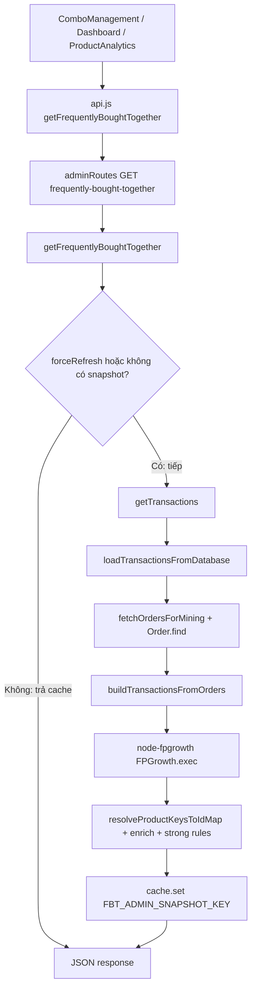

# Luồng code: từ frontend → MongoDB → thuật toán thật (FBT / FP-Growth / gợi ý giỏ)

Tài liệu mô tả **chuỗi gọi thật** trong DMProject: trang admin hoặc giỏ gọi API → Express → `recommendationService.js` → đọc `Order` / `Product` (hoặc file JSON nếu bật env) → **`node-fpgrowth`** / mining luật cặp → cache NodeCache → JSON trả về.

**Base URL frontend:** `frontend/src/services/api.js` dùng `fetchBaseQuery` với  
`baseUrl = process.env.REACT_APP_API_URL || 'http://localhost:5000/api'`.  
Mọi path dưới đây là **suffix** sau `/api` (ví dụ đầy đủ: `http://localhost:5000/api/admin/reports/frequently-bought-together`).

---

## 1. Điều kiện nguồn dữ liệu (env)

| Biến | File khai báo | Ý nghĩa |
|------|----------------|--------|
| `FBT_USE_FP_JSON` | `backend/node/services/recommendationService.js` | `true` → giao dịch / luật một phần từ **`fp_transactions.json`** và file `fp_*.json` khác. **Mặc định false** → mining từ **MongoDB `Order`**. |
| `FBT_ORDER_STATUSES` | cùng file | Đơn dùng để mining (CSV), mặc định `shipped`, `delivered`. |
| `FBT_DB_TRANSACTIONS_CACHE_SEC` | cùng file | TTL cache RAM danh sách giao dịch đã parse từ DB (`fp:transactions:db:*`). |
| `FBT_CACHE_TTL_SEC` | cùng file | TTL snapshot kết quả FBT admin trong NodeCache. |

---

## 2. Nhánh A — FBT admin: “Gợi ý combo” / bảng thường mua cùng (FP-Growth đầy đủ)

Đây là luồng **mỗi lần chạy thật** sẽ: lấy giao dịch → `FPGrowth.exec(...)` → enrich `Product` → sinh / lọc luật mạnh → (tuỳ) lưu snapshot.

### 2.1. Frontend (ai gọi API)

| Thứ tự | File | Hàm / hook / UI | Việc làm |
|--------|------|------------------|----------|
| 1 | `frontend/src/services/api.js` | `getFrequentlyBoughtTogether` (RTK Query `builder.query`) | **GET** `admin/reports/frequently-bought-together` với query: `minSupport`, `orderLimit`, `minConfidence`, `minLift`, `minConviction`; nếu `params.force` → thêm `force: 'true'`. `transformResponse` chuẩn hoá `frequentItemsets` cho UI. |
| 2 | `frontend/src/pages/admin/ComboManagement.js` | `useGetFrequentlyBoughtTogetherQuery(fbtQueryParams)` | `fbtQueryParams` = bộ lọc + `{ force: true }` khi `pendingFbtForce` (nút **Chạy lại thuật toán** → `setPendingFbtForce(true)`). `skip: activeTab === 'builder'` để tab Tạo combo không gọi FBT. |
| 3 | `frontend/src/pages/admin/AdminDashboard.js` | Cùng hook | Bộ lọc debounce → refetch. |
| 4 | `frontend/src/pages/admin/ProductAnalytics.js` | Cùng hook | `skip: activeTab !== 'frequentlyBought'`. |
| 5 | `frontend/src/components/admin/FrequentlyBoughtTogetherTable.js` | Component | Hiển thị / phân trang / bộ lọc UI; **không** chạy thuật toán trên browser. |

### 2.2. Backend — mount route

| File | Nội dung |
|------|----------|
| `backend/node/server.js` | `app.use("/api/admin", adminRoutes)` |
| `backend/node/routes/adminRoutes.js` | **GET** `/reports/frequently-bought-together`: middleware `protect`, `isAdmin`; đọc query; `forceRefresh` = true nếu `force` / `refresh` query; gọi **`getFrequentlyBoughtTogether(minSupport, orderLimit, minConfidence, minLift, minConviction, { forceRefresh })`** — import từ `recommendationService`, **không** qua `adminController` cho route này. |

### 2.3. Backend — `recommendationService.js` (chuỗi hàm chi tiết)

Tất cả tên hàm dưới đây nằm trong **`backend/node/services/recommendationService.js`** trừ khi ghi rõ file khác.

#### Bước snapshot (có thể **không** chạy thuật toán)

| Hàm | Vai trò |
|-----|---------|
| **`getFrequentlyBoughtTogether(...)`** | Entry chính FBT admin. Nếu **không** `forceRefresh` và NodeCache có **`FBT_ADMIN_SNAPSHOT_KEY`** (`frequently-bought-together-admin-snapshot`, bản `__fbtV2`): **trả `snap.payload`**, gắn `info.fbtFromCache`, `fbtSnapshot`, `fbtIgnoredQueryParams` — **không** đọc DB mới, **không** `FPGrowth.exec`. |
| | Nếu **`forceRefresh === true`**: log “bỏ qua snapshot”, đi tiếp pipeline đầy đủ bên dưới. |

#### Bước lấy giao dịch (DB hoặc JSON)

| Hàm | Vai trò |
|-----|---------|
| **`getTransactions(orderLimit, { forceRefresh })`** | `orderLimit` ở đây là **số đơn / giao dịch mục tiêu** (`targetFbtValidCount`). Nếu `FBT_USE_FP_JSON`: `loadFpTransactionsArray`. Ngược lại: tính `dbLimit`, log “MongoDB Order”, gọi **`loadTransactionsFromDatabase(dbLimit, { force })`** với `force = forceRefresh`. |
| **`loadTransactionsFromDatabase`** | Cache key `fp:transactions:db:${orderLimit}`. Nếu không `force` và còn TTL → trả cache. Ngược lại: **`fetchOrdersForMining`** → **`buildTransactionsFromOrders`** → `cache.set` (nếu TTL > 0). |
| **`fetchOrdersForMining(limit)`** | `Order.find(filter).sort({ createdAt: -1 }).limit(cap).select("orderItems status createdAt").lean()` — nhiều vòng filter (`FBT_ORDER_STATUSES`, rồi nới nếu ít đơn). Model: **`backend/node/models/Order.js`**. |
| **`buildTransactionsFromOrders(orders)`** | Mỗi đơn: duyệt `orderItems`, lấy `li.product` → `String(pid)` (thường ObjectId), unique trong đơn; mỗi đơn ≥1 item → một mảng giao dịch. |

#### Bước chạy FP-Growth thật

| Hàm / API | Vai trò |
|-----------|---------|
| **`getFrequentlyBoughtTogether` (tiếp)** | Lọc `validTransactions` (mảng chuỗi, unique). Nếu `< 2` đơn → trả lỗi, không gọi FP-Growth. |
| | `usedMinSupport` = tham số `minSupport` hợp lệ hoặc **`getDynamicMinSupport(validTransactions.length)`**. |
| **`FPGrowth`** (`require("node-fpgrowth")`) | `new FPGrowth.FPGrowth(usedMinSupport)` rồi **`fpgrowth.exec(validTransactions)`** trong Promise + timeout — đây là **chạy thuật toán thật** trên RAM. |

#### Bước sau FP-Growth: xếp hạng, enrich, luật mạnh, lưu snapshot

| Hàm | Vai trò |
|-----|---------|
| (inline trong `getFrequentlyBoughtTogether`) | Xếp hạng mẫu theo `actualFrequency`, cắt top **`FBT_MAX_PATTERNS_ENRICH`** (env, mặc định 800). |
| **`resolveProductKeysToIdMap(keys)`** | Map khóa (id/sku string) → ObjectId qua **`Product.find`**. |
| **`Product.find`** | Mongoose model Product — lấy chi tiết cho từng pattern / luật. |
| **`mineStrongAssociationRulesFromFrequentItemsets`** | Khi không dùng JSON: sinh luật mạnh từ tập phổ biến + `validTransactions`. |
| **`filterStrongRulesByThresholds`** | Lọc theo `minConfidence`, `minLift`, `minConviction`. |
| **`enrichStrongRulesWithProducts`** | Gắn object sản phẩm cho antecedent/consequent. |
| **`cache.set(FBT_ADMIN_SNAPSHOT_KEY, { __fbtV2: true, payload: result, cachedAt })`** | Lưu **snapshot** cho lần sau (khi không `force`). |
| Log | “Kết quả đã được tính toán và cache”. |

### 2.4. Sơ đồ Mermaid (FBT admin)

---

## 3. “Chạy lại thuật toán thật” — các cách trong hệ thống

| Cách | Trigger | Hành vi chính |
|------|---------|----------------|
| **A. Nút / `force=true` trên GET FBT** | Frontend gửi `force=true` → `forceRefresh` trong **`getFrequentlyBoughtTogether`** | Bỏ đọc snapshot; gọi **`getTransactions(..., { forceRefresh: true })`** → có thể bỏ cache giao dịch RAM; chạy lại **`fpgrowth.exec`**; ghi snapshot mới. |
| **B. `invalidateFbtComputedResultsCache()`** | Cron trong **`server.js`** (`cron.schedule('0 0 */3 * *', ...)`) | Xóa key prefix `frequently-bought-together-*`; nếu không JSON mode → **`clearDbMiningCacheKeys()`** (xóa `fp:pair-rules:db`, mọi `fp:transactions:db:*`). **Không** tự gọi FP-Growth; lần **request FBT admin kế tiếp** mới tính lại (nếu không có snapshot). |
| **C. `updateFPGrowthRecommendations()`** | Cùng cron sau B | Đọc giao dịch, chạy FP-Growth **hai lần** (admin + customer minSupport), **`cache.set`** `fp-growth` và `fp-growth-customer` — phục vụ gợi ý homepage / khách, khác snapshot FBT admin đầy đủ. |
| **D. `clearRecommendationCache()`** | **POST** `api/admin/reports/recommendations-cache/clear` (`adminRoutes.js`) | **`cache.flushAll()`** — xóa **toàn bộ** NodeCache recommendation; sau đó **`preloadFpSourceFiles`** (chế độ MongoDB thì chỉ log / clear DB mining keys tuỳ nhánh). |

**Lưu ý cron:** `'0 0 */3 * *'` = 00:00 vào các **ngày trong tháng** theo bước 3 (không phải đúng 72 giờ lệch). Chỉ chạy khi process Node sống tới mốc đó.

---

## 4. Nhánh B — Luật cặp từ đơn (pair rules) — dùng cho giỏ / trang chi tiết

| Hàm | Vai trò |
|-----|---------|
| **`getPairAssociationRules`** | Nếu JSON mode: `loadFpPairRulesArray`. Ngược lại: `fetchOrdersForMining(FBT_PAIR_RULES_ORDER_LIMIT)` → `buildTransactionsFromOrders` → **`minePairAssociationRulesFromTransactions`** → cache key `fp:pair-rules:db` (TTL `FBT_DB_PAIR_RULES_SEC`). |
| **`filterPairRulesForCustomer`** | Lọc support / confidence / lift / độ dài itemset cho khách. |
| **`getCartRecommendations`** | Dựng `cartKeySet` (id + sku sau **`Product.find`**); lọc luật liên quan; **`resolveProductKeysToIdMap`**; fallback **`getSuggestionKeysFromFpGrowthPatterns`** → **`getFPGrowthRecommendations({ forCustomer: true })`**; cuối có thể **sản phẩm nổi bật**. |

---

## 5. Nhánh C — Gợi ý giỏ: frontend → API → `getCartRecommendations`

### Frontend

| File | Hook / endpoint |
|------|------------------|
| `frontend/src/components/CartDrawer.js` | `useGetCartQuery` (có `recommendations` nếu đăng nhập); nếu không dùng được → `useGetCartSuggestionsQuery`. |
| `frontend/src/services/api.js` | `getCart` → **GET** `cart`. `getCartSuggestions` → **GET** `analytics/cart-suggestions` + `productIds`, `limit`. |

### Backend

| File | Hàm / route |
|------|-------------|
| `backend/node/routes/cartRoutes.js` | → **`cartController.getCart`**: `Cart` / `GuestCart` **populate** `items.product` → **`getCartRecommendations(cart.items)`**. |
| `backend/node/controllers/analyticsController.js` | **`getCartSuggestions`**: parse `productIds` (ObjectId hợp lệ) → pseudo `cartItems` → **`getCartRecommendations(cartItems, limit)`**. |

**Lưu ý:** Luồng giỏ **không** chạy lại full pipeline FBT admin; có thể dùng **luật cặp** (mine từ DB/cache) + **FP-Growth đã cache** (`fp-growth-customer`).

---

## 6. File tham chiếu nhanh

| Mục đích | File |
|----------|------|
| Toàn bộ mining / FP-Growth / cache / giỏ | `backend/node/services/recommendationService.js` |
| Route FBT + clear cache | `backend/node/routes/adminRoutes.js` |
| Giỏ | `backend/node/controllers/cartController.js` |
| Cart-suggestions công khai | `backend/node/controllers/analyticsController.js` |
| Schema đơn | `backend/node/models/Order.js` |
| Cron | `backend/node/server.js` |
| RTK Query | `frontend/src/services/api.js` |
| UI FBT admin | `frontend/src/pages/admin/ComboManagement.js`, `FrequentlyBoughtTogetherTable.js` |

---

*Tài liệu phản ánh codebase tại thời điểm cập nhật; nếu đổi route hoặc tên hàm, chỉnh lại bảng tương ứng.*
